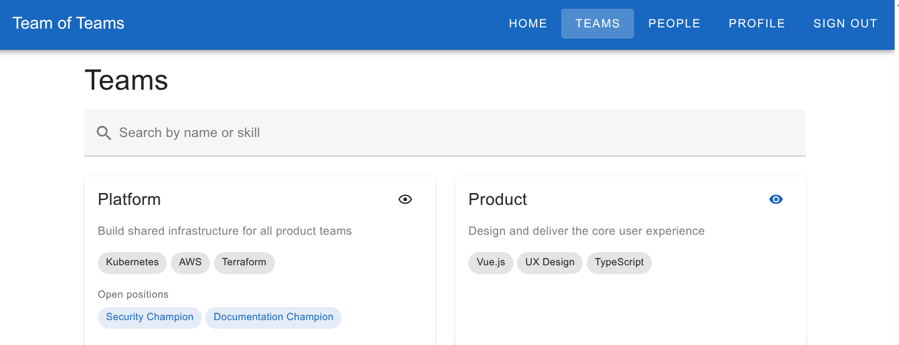

# Paper Prototypes - Team of Teams

> [!WARNING]
> **AI-authored:** This change was autonomously planned and implemented by an AI software factory from a human-authored specification, with possible subsequent human review or modification.

> [!WARNING]
> This experiment is effectively abandoned. The generated material is retained primarily as a research artifact.

A prototype for dynamic, self-assembling communities, teams, memberships, observers, and roles.

```sh
make serve
```

| Ref1                        | Ref2                        |
| --------------------------- | --------------------------- |
|  |  |

## Notes

- Neat, but ultimately throw-away
